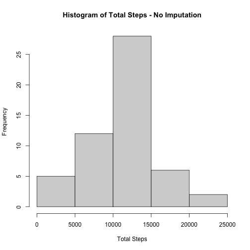
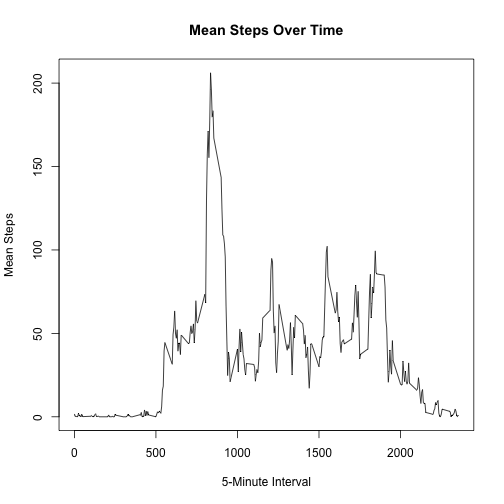
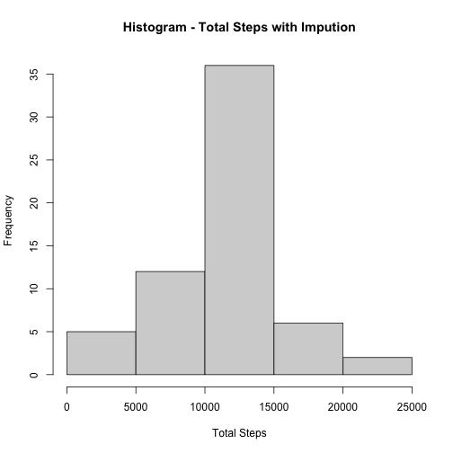
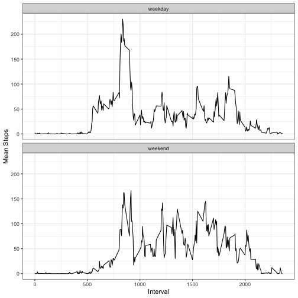

## Reproducible Research Assignment

## Overview
It is now possible to collect a large amount of data about personal movement using activity monitoring devices such as a [Fitbit](http://www.fitbit.com/), [Nike Fuelband](http://www.nike.com/us/en_us/c/nikeplus-fuelband), or [Jawbone Up](https://jawbone.com/up).

These type of devices are part of the “quantified self” movement – a group of enthusiasts who take measurements about themselves regularly to improve their health, to find patterns in their behavior, or because they are tech geeks. But these data remain under-utilized both because the raw data are hard to obtain and there is a lack of statistical methods and software for processing and interpreting the data.

This assignment makes use of data from a personal activity monitoring device. This device collects data at 5 minute intervals through out the day. The data consists of two months of data from an anonymous individual collected during the months of October and November, 2012 and include the number of steps taken in 5 minute intervals each day.

## Full Submission Requirements

    1. Code for reading in the dataset and/or processing the data
    2. Histogram of the total number of steps taken each day
    3. Mean and median number of steps taken each day
    4. Time series plot of the average number of steps taken
    5. The 5-minute interval that, on average, contains the maximum number of steps
    6. Code to describe and show a strategy for imputing missing data
    7. Histogram of the total number of steps taken each day after missing values are imputed
    8. Panel plot comparing the average number of steps taken per 5-minute interval across weekdays and weekends
    9. All of the R code needed to reproduce the results (numbers, plots, etc.) in the report

<br>

### Code for Reading in the Dataset and / or Processing the data


read.csv is used to read the CSV file into a data frame. The following line data.frame(rawData) creates a data frame object named dfData from the rawData object. This step allows further analysis and manipulations on the data.


```r
rawData <- read.csv("activity.csv", header=TRUE)
dfData <- data.frame(rawData)
```

<br>

### Histogram of the Total Number of Steps Taken Each Day
In the assignment, we are told to research the difference between a histogram and a barplot. The instructions state:

> 'If you do not understand the difference between a histogram and a barplot, research the difference between them.'

Briefly, a histogram is used to display the distribution of a continuous variable. A barplot is used to display categorical or discrete data. Since steps is our measurement and it is continuous rather than categorical, a histogram is appropriate.

This part of the assignment lists 3 steps:

1. Calculate the total number of steps taken per day
2. Make a histogram of the total number of steps taken each day
3. Calculate and report the mean and median of the total number of steps taken per day

It also states:

> 'For this part of the assignment, you can ignore the missing values in the dataset.'

This can be interpreted as telling us to explicitly ignore missing values *or* to disregard missing values in the data. I chose to implment this explicitly ignoring the missing value but I don't think the end results differ in any case.

#### Regardless, the first step is to *Calculate the total number of steps taken per day*. Here is the code for that.

You can see in the 2nd line, I explicity remove the missing data. Then I just rename the columns.


```r
dfData <- aggregate(dfData$steps, list(dfData$date), FUN=sum)
dfData <- na.omit(dfData)
colnames(dfData) <- c("Date", "TotalSteps")
```

So now the first few rows of our data set looks like this:


```
##         Date TotalSteps
## 2 2012-10-02        126
## 3 2012-10-03      11352
## 4 2012-10-04      12116
## 5 2012-10-05      13294
## 6 2012-10-06      15420
## 7 2012-10-07      11015
```


#### Next, *Make a histogram of the total number of steps taken each day*

The code for this is as follows. I am using base R for this because it's very simple to create a histogram. I've also titled this with 'No Imputation' to help distinguish the chart from a later plot with imputed data.


```r
hist(dfData$TotalSteps, xlab = "Total Steps", main = "Histogram of Total Steps - No Imputation")
```



### Mean and Median Number of Steps Taken Each Day

#### And now calculate the mean and median.

Here is the code:


```r
mean_steps <- mean(dfData$TotalSteps)
median_steps <- median(dfData$TotalSteps)
```


|           Metric           |  Value   |
|:--------------------------:|:--------:|
|  Mean Total Steps Per Day  | 10766.19 |
| Median Total Steps Per Day | 10765.00 |

### Time Series Plot of the Average Number of Steps Taken

The instructions for this state:

>
'Make a time series plot (i.e. type = "l") of the 5-minute interval (x-axis) and the average number of steps taken, averaged across all days (y-axis)'

So this means we need a new calculation. Instead of aggregating total steps per day as before, we need to calculate the average per 5 minute interval. 


Here is the code for this. Note the main difference is using $interval and FUN=mean


```r
meanData <- aggregate(dfData$steps, list(dfData$interval), FUN=mean)
colnames(meanData) <- c("Interval", "MeanSteps")
```


So the first few rows of meanData now looks like:

```
##   Interval MeanSteps
## 1        0 1.7169811
## 2        5 0.3396226
## 3       10 0.1320755
## 4       15 0.1509434
## 5       20 0.0754717
## 6       25 2.0943396
```

<br>

And again using base R to make the plot. Note the type = "l" as specified in the requirements.

<br>


```r
plot(meanData$Interval, meanData$MeanSteps, type = "l", 
     xlab = "5-Minute Interval", ylab = "Mean Steps", main = "Mean Steps Over Time")
```



### The 5-Minute Interval That, on Average, Contains the Maximum Number of Steps

Here is the code for this. First, determine the the maximum average steps. This is easily done since the meanData data set already contains the averages. The second line determines which interval corresponds to that maximum value.


```r
max_steps <- max(meanData$MeanSteps)
max_interval <- meanData[meanData$MeanSteps == max_steps, "Interval"]
```

Which results in identifying the following interval. Comparing this to the line chart above you can see these answers align.


```
## [1] "The maximum interval is: 835"
```

### Code to Describe and Show a Strategy for Imputing Missing Data

We are told:

>
'Devise a strategy for filling in all of the missing values in the dataset. The strategy does not need to be sophisticated. For example, you could use the mean/median for that day, or the mean for that 5-minute interval, etc.'


I am going to use the mean steps for the particular interval containing each NA.I also tried different approaches, using mean steps per day and just mean steps overall. There wasn't a massive difference overall. So the strategy I've chosen is to calculate the mean per interval as in the previous requirement. I first removed the NA observations from the activity data then calculated the average per interval. Then I went back and replaced the NA observations with the mean for the specific interval in which they were found.


To sanity check this, I first wanted to figure out how many NA observations we had in the raw data. It's a simple check and I used the following:


```
## [1] "Number of raw observations with no step data - before replacement: 2304"
```

And as before, calculate the mean per interval. This is the same as above when we plotted the time series.


```r
meanSteps_df <- aggregate(dfData_noNA_df$steps, list(dfData_noNA_df$interval), FUN = mean)
colnames(meanSteps_df) <- c("Interval", "MeanSteps")
```

And this is a repeat but the top few rows of this data set are (not surprisingly) the same as above.

```
##   Interval MeanSteps
## 1        0 1.7169811
## 2        5 0.3396226
## 3       10 0.1320755
## 4       15 0.1509434
## 5       20 0.0754717
## 6       25 2.0943396
```


The next step here is to replace the NA observations with the mean steps for the specific interval where data is missing. The following code does this.

This code first checks the original data set (dfData) for missing step values. If there is a missing value, we need to get the mean steps for that interval. The match clause below indexes the meanSteps_df with the matched index for the missing observation. If there is a non-NA observation, the data is left unchanged.


```r
dfData$steps <- ifelse(is.na(dfData$steps),
                       meanSteps_df$MeanSteps[match(dfData$interval, meanSteps_df$Interval)],
                       dfData$steps)
```

And as a quick sanity check, we can repeat the count for NA observations. This is the same test as above.


```
## [1] "Number of raw observations with no step data - after replacement: 0"
```

And we now have no missing observations.

To further check this has all worked, here is a comparison of element #45, in the raw data, the mean calculated for the interval and the element 45 in the imputed data. (I picked element 45 randomly from observations with missing raw data)


```
## [1] "Interval and Observation for Element #45 in the raw data is 340 and NA"
```

```
## [1] "The calculated mean for interval 340 is 0.490566037735849"
```

```
## [1] "And the imputed value in the data set for interval 340 is now 0.490566037735849"
```

So this all works as expected.

### Histogram of the Total Number of Steps Taken Each Day After Missing Values are Imputed

This is asking to create the same histogram as above but this time using the data set with imputed data. So as before, the first step is to create a data set aggregated by date.


```r
dailySteps_df <- aggregate(dfData$steps, list(dfData$date), FUN=sum)
colnames(dailySteps_df) <- c("Date", "DailySteps")
```

Here are the first few records of the resulting data set. Comparing this with the original data set, there is now a record for 2012-10-01. In the original data set, we did not have that so even though the histograms appear very similar, the data has changed.


```
##         Date DailySteps
## 1 2012-10-01   10766.19
## 2 2012-10-02     126.00
## 3 2012-10-03   11352.00
## 4 2012-10-04   12116.00
## 5 2012-10-05   13294.00
## 6 2012-10-06   15420.00
```

Then we can generate the histogram with this imputed data set. 


```r
hist(dailySteps_df$DailySteps, xlab = "Total Steps", main = "Histogram - Total Steps with Impution")
```



### Panel Plot Comparing the Average Number of Steps Taken per 5-Minute Interval Across Weekdays and Weekends

Instead of recalculating the entire imputed data set, in the previous step, I wrote the data out to a new file called "imputed_data.csv". First step here is to read that file in.


```r
rawData <- read.csv("imputed_data.csv", header=TRUE)
dfData <- data.frame(rawData)
```

We are instructed to add a new categorical factor to the data indicating whether the date is a weekend or weekday. This will allow analysis by that category. 

To do this, I use the weekdays function in the lubridate package. The code below converts the date in dfData to a Date and then creates a new factor called day_type. I populate this with a simple if-else statement. If the weekdays function identifies a date as Saturday or Sunday, then fill with weekend, otherwise fill with weekday. There's probably a better way to do it.


```r
dfData$date <- as.Date(dfData$date)
dfData$day_type <- ifelse(weekdays(dfData$date) %in% c("Saturday", "Sunday"), "weekend", "weekday")
```

And now a quick look at the data confirms this works as expected.


```
##   X     steps       date interval day_type
## 1 1 1.7169811 2012-10-01        0  weekday
## 2 2 0.3396226 2012-10-01        5  weekday
## 3 3 0.1320755 2012-10-01       10  weekday
## 4 4 0.1509434 2012-10-01       15  weekday
## 5 5 0.0754717 2012-10-01       20  weekday
## 6 6 2.0943396 2012-10-01       25  weekday
```


We are instructed to:

>
'Make a panel plot containing a time series plot (i.e. type = "l") of the 5-minute interval (x-axis) and the average number of steps taken, averaged across all weekday days or weekend days (y-axis).'

<br>

To do this, we first calculate the average number of steps taken per 5 minute interval. We've done this before but now need to do this for both weekends and weekdays.

In the following code, the order of arguments to the list() is important. We first want to group by weekend / weekday, and then group by the interval and calculate the mean of those groupings.


```r
meanSteps_byDayType <- aggregate(dfData$steps, 
                               list(dfData$day_type, dfData$interval), FUN=mean)
colnames(meanSteps_byDayType) <- c("day_type", "interval", "mean_steps")
```

This data set looks like:


```
##   day_type interval mean_steps
## 1  weekday        0 2.25115304
## 2  weekend        0 0.21462264
## 3  weekday        5 0.44528302
## 4  weekend        5 0.04245283
## 5  weekday       10 0.17316562
## 6  weekend       10 0.01650943
```

Notice there are now 2 records per interval. One for weekend and one for weekday. This is what we want.

And now, we can create a panel plot comparing weekends and weekdays. The following code does that using ggplot2.


```r
plot <- ggplot(meanSteps_byDayType, aes(x = interval, y = mean_steps)) +
  geom_line() + xlab("Interval") + ylab("Mean Steps") +
  theme_bw()

plot_panel <- plot + facet_wrap(~ day_type, nrow=2)

print(plot_panel)
```



## Complete!
This contains all code, plots and descriptions necessary to fulfull the requirements for this assignment. Thank you for the review!
